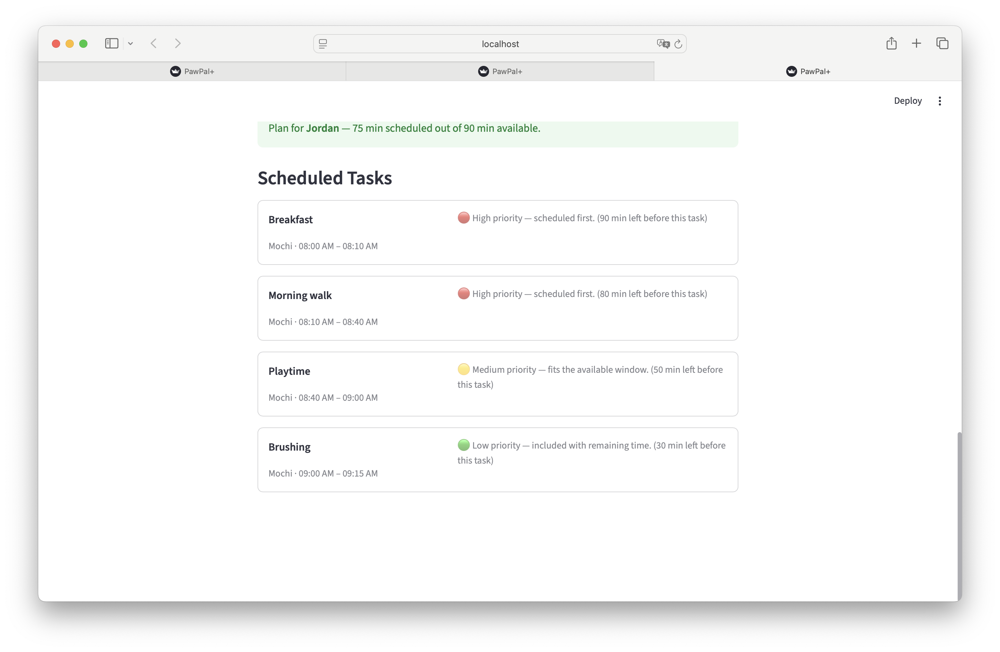

# PawPal+ (Module 2 Project)

**PawPal+** is a Streamlit app that helps a busy pet owner plan daily care tasks across multiple pets, with intelligent scheduling, conflict detection, and recurring task management.

---

## Features

### Core scheduling
- **Priority-based daily plan** — tasks are ranked `high > medium > low`; within a tier, shorter tasks are scheduled first to maximise the number of completed items
- **Time budget enforcement** — the owner sets available minutes for the day; any task that doesn't fit is moved to a "Skipped" list with a plain-language explanation
- **Multi-pet support** — add as many pets as needed; the scheduler pulls tasks from all pets and assigns each scheduled task to the correct pet

### Smarter scheduling algorithms

| Feature | Method | What it does |
|---|---|---|
| **Sort by duration** | `Scheduler.sort_by_time(tasks)` | Returns tasks ordered shortest-first using a `lambda` key on `duration_minutes` |
| **Filter tasks** | `Scheduler.filter_tasks(pet_name, completed)` | Returns `(task, pet)` pairs filtered by pet name and/or completion status — combinable |
| **Recurring tasks** | `Task.next_occurrence()` + `Scheduler.advance_recurring_tasks()` | When a `daily`/`weekly` task is marked complete, creates a fresh copy due `timedelta(days=1)` or `timedelta(weeks=1)` later and swaps it in place |
| **Conflict detection** | `Scheduler.detect_conflicts(plan)` | Pairwise O(n²) interval check; returns warning strings for any overlapping time windows without crashing |

### UI highlights
- Sorted task overview table (all pets, shortest-first) always visible before scheduling
- Conflict warnings surfaced as `st.error` / `st.warning` banners immediately after plan generation
- Inline due-date display on every task card
- One-click "Roll over recurring tasks" button advances all completed daily/weekly tasks to their next occurrence

---

## 📸 Demo

**Owner & pet setup**

<a href="screenshot_1.png" target="_blank"></a>

**Sorted task overview**

<a href="screenshot_2.png" target="_blank"></a>

**Generated daily schedule**

<a href="screenshot_3.png" target="_blank"></a>

---

## Testing PawPal+

Run the full test suite from the project root:

```bash
python -m pytest
```

With verbose output:

```bash
python -m pytest tests/test_pawpal.py -v
```

### What the tests cover

| Category | # Tests | What is verified |
|---|---|---|
| **Task lifecycle** | 3 | `mark_complete()` changes status; completed tasks excluded from plan; `reset()` restores pending |
| **Pet task management** | 4 | `add_task()` increases count; all tasks stored; `remove_task()` shrinks list; `pending_tasks()` excludes completed |
| **Owner aggregation** | 4 | `add_pet()` registers pets; `get_all_tasks()` merges across pets; `get_pending_tasks()` skips completed; `find_pet()` is case-insensitive |
| **Core scheduling** | 5 | Plan built from owner's pets; time budget enforced; high priority first; completed tasks skipped |
| **Sorting** | 2 | Ascending duration order; empty list handled |
| **Filtering** | 4 | By pet name; by status; combined; non-existent pet returns empty |
| **Recurring tasks** | 6 | Daily +1 day; weekly +7 days; as-needed → None; next occurrence resets `completed`; `advance_recurring_tasks()` swaps in place; as-needed not replaced |
| **Conflict detection** | 4 | Exact overlap flagged; sequential (touching) slots pass; partial overlap flagged; empty plan returns no warnings |
| **Edge cases** | 8 | Chronological order; no pets → empty plan; pet with no tasks; `available_minutes=0`; empty sort; non-existent pet filter; case-insensitive filter; exact budget boundary |

**Total: 39 tests, all passing.**

### Confidence level

★★★★☆ (4/5) — Core scheduling invariants are thoroughly covered with both happy-path and edge-case tests. The remaining gap is integration-level testing of the Streamlit UI layer and multi-pet parallel scheduling scenarios.

---

## Project structure

```
pawpal_system.py   # Domain model + Scheduler (logic layer)
app.py             # Streamlit UI
main.py            # CLI demo script
tests/
  test_pawpal.py   # 39 automated tests
uml.md             # Final Mermaid class diagram
reflection.md      # Design and AI collaboration reflection
requirements.txt
```

---

## Getting started

### Setup

```bash
python -m venv .venv
source .venv/bin/activate  # Windows: .venv\Scripts\activate
pip install -r requirements.txt
```

### Run the app

```bash
streamlit run app.py
```

### Run the CLI demo

```bash
python main.py
```

### Suggested workflow

1. Read the scenario carefully and identify requirements and edge cases.
2. Draft a UML diagram (classes, attributes, methods, relationships).
3. Convert UML into Python class stubs (no logic yet).
4. Implement scheduling logic in small increments.
5. Add tests to verify key behaviors.
6. Connect your logic to the Streamlit UI in `app.py`.
7. Refine UML so it matches what you actually built.
