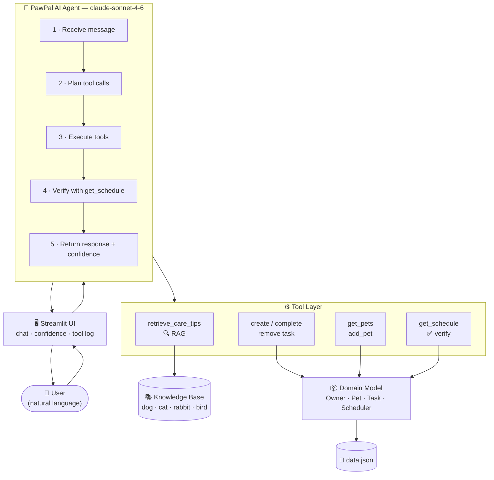
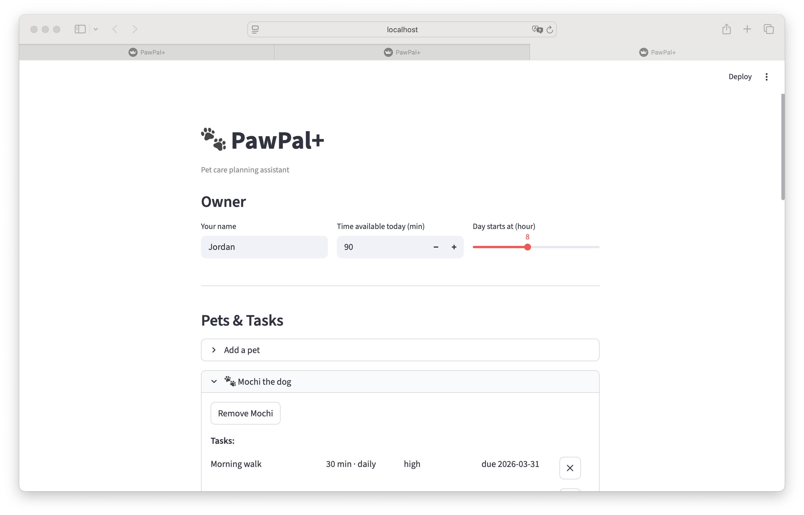
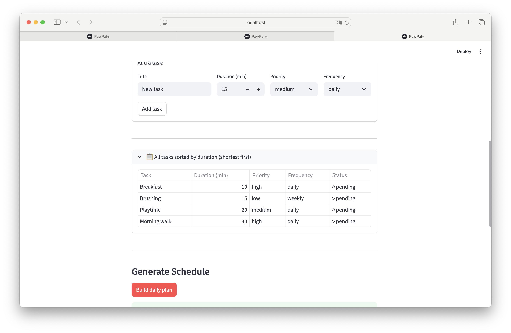

# PawPal+ AI — Applied AI Capstone

## Original Project

**PawPal+** (Modules 1–3) is a Streamlit app that helps busy pet owners plan daily care tasks across multiple pets. It features a greedy priority-based scheduler, urgency-weighted scoring, conflict detection, recurring task rollover, and full JSON persistence — all backed by a clean domain model (`Owner / Pet / Task / Scheduler`) with 39 automated tests.

This capstone extends PawPal+ with a fully integrated **agentic AI workflow** powered by the Claude API: a conversational assistant that interprets natural-language requests, calls tools to manage the real pet-care data, verifies its own actions, and reports a confidence score with every response.

> See [model_card.md](model_card.md) for the full reflection on AI collaboration, biases, limitations, and testing results.

---

## Title and Summary

**PawPal+ AI** — a pet care scheduling assistant you can talk to.

Instead of clicking through forms, owners say *"Set up a daily routine for my new rabbit Biscuit"* and the AI retrieves species-specific care facts from a knowledge base (RAG), creates the appropriate tasks, then verifies the resulting schedule — all in one turn. Every change the AI makes is persisted to `data.json` and immediately visible in the Pets & Tasks and Schedule tabs.

---

## Architecture Overview

> Full diagram with component descriptions: [assets/architecture.md](assets/architecture.md)



**Data flow:** User message → Claude reasons → calls tools → results feed back into Claude → Claude calls `get_schedule` to verify → final text + confidence score returned to UI.

**Human checkpoints:** Confidence score (🟢 ≥ 80% · 🟡 50–79% · 🔴 < 50%) and collapsible tool call log on every AI response. All changes immediately visible in other tabs.

---

## AI Features

| Feature | Implementation |
|---|---|
| **Agentic Workflow** | Claude calls tools in a loop until `stop_reason == "end_turn"`. The agent always calls `get_schedule` after mutations to verify its own work. |
| **RAG** | `retrieve_care_tips` fetches curated species knowledge (essential tasks, health notes, tips) from a built-in store before generating recommendations. |
| **Confidence Scoring** | System prompt requires `CONFIDENCE: 0.X` on every response. Parsed, clamped, and displayed in the UI. |
| **Prompt Caching** | System prompt sent with `cache_control: ephemeral` — processed once per session, reducing latency and cost. |
| **Logging & Guardrails** | Every tool call is logged. Tool exceptions return JSON error objects. `MAX_TOOL_LOOPS = 10` prevents runaway loops. |

---

## Setup Instructions

### 1. Clone and create a virtual environment

```bash
git clone https://github.com/ktran70/applied-ai-system
cd applied-ai-system
python -m venv .venv
source .venv/bin/activate      # Windows: .venv\Scripts\activate
```

### 2. Install dependencies

```bash
pip install -r requirements.txt
```

### 3. Set your Anthropic API key

```bash
cp .env.example .env
# Open .env and paste your key
export ANTHROPIC_API_KEY=your_key_here
```

Or on Windows PowerShell:

```powershell
$env:ANTHROPIC_API_KEY="your_key_here"
```

### 4. Run the app

```bash
streamlit run app.py
```

Open `http://localhost:8501` and navigate to the **🤖 AI Assistant** tab.

### 5. Run all tests (no API key required)

```bash
python -m pytest -v
```

### 6. Run the CLI demo (optional)

```bash
python main.py
```

---

## Demo Walkthrough

> 📹 **[Loom walkthrough →](https://www.loom.com/share/REPLACE_WITH_YOUR_LOOM_LINK)**
> *(Record a 2–3 min screen capture showing the three sample interactions below, then paste your Loom URL here before submitting.)*

### Screenshot 1 — Owner & pet setup (Pets & Tasks tab)



### Screenshot 2 — Sorted task overview



### Screenshot 3 — Generated daily schedule


---

## Sample Interactions

### Interaction 1 — Build a full routine from scratch

**Input:** `Set up a complete daily care routine for my new rabbit named Biscuit.`

**Agent tool calls:**
1. `retrieve_care_tips(species="rabbit")` → fetches hay, water, greens, playtime, cleaning tasks from knowledge base
2. `add_pet(name="Biscuit", species="rabbit", age_years=1.0)`
3. `create_task(...)` × 6 tasks
4. `get_schedule()` → verifies 75 min scheduled, 0 conflicts

**AI response:**
> I've set up Biscuit's daily routine with 6 tasks: unlimited hay (10 min), fresh water (5 min), pellet feeding (5 min), leafy greens (10 min), supervised playtime (30 min), and a daily spot-clean (15 min). The schedule fits in 75 minutes with no conflicts. Important: hay should always be available — it makes up 80% of a rabbit's diet and prevents GI stasis, the #1 health risk.
>
> `CONFIDENCE: 0.95`

---

### Interaction 2 — Mark tasks done, check what remains

**Input:** `Mochi finished her morning walk and breakfast. What's left for today?`

**Agent tool calls:**
1. `complete_task(pet_name="Mochi", task_title="Morning walk")`
2. `complete_task(pet_name="Mochi", task_title="Breakfast")`
3. `get_schedule()` → 2 tasks remain

**AI response:**
> Done! Marked Morning walk and Breakfast complete for Mochi. Two tasks remain: **Playtime** (20 min, medium priority) and **Brushing** (15 min, low priority, weekly). Total remaining: 35 minutes.
>
> `CONFIDENCE: 0.95`

---

### Interaction 3 — Species care advice

**Input:** `What are the most important things to know about caring for a bird?`

**Agent tool calls:**
1. `retrieve_care_tips(species="bird")` → health notes + tips retrieved

**AI response:**
> Key bird care facts from the knowledge base: **(1)** Non-stick cookware (PTFE/Teflon) fumes can be fatal — never use them near birds. **(2)** Birds hide illness; changes in droppings or feathers need immediate vet attention. **(3)** They need 10–12 hours of sleep in a quiet, dark space. **(4)** Toxic foods: avocado, chocolate, onion, caffeine. For a daily routine I'd suggest fresh food, water change, cage spot-clean, and 20 minutes of out-of-cage interaction — plus a weekly deep clean.
>
> `CONFIDENCE: 0.85`

---

## Design Decisions

### Why an agentic workflow over a simple Q&A chatbot?

A Q&A bot would only describe what *should* be done. The agentic loop lets Claude actually mutate the pet schedule and then verify the result — making it genuinely useful rather than advisory-only.

**Trade-off:** Agentic calls are slower (multiple round-trips) and cost more tokens than a one-shot prompt.

### Why RAG for care tips instead of relying on training data?

Claude already knows pet care facts, but that knowledge is opaque and can drift between model versions. Storing tips in `_CARE_KNOWLEDGE` and retrieving them explicitly keeps suggestions auditable and consistent. The system prompt enforces the retrieval step rather than hoping the model remembers it.

**Trade-off:** The knowledge base is small and hand-curated. A production system would use a vector store (e.g. pgvector + embeddings) for larger, dynamic knowledge.

### Why confidence scores?

They give users a quick reliability signal and incentivise the agent to verify its own work — the system prompt ties 0.9+ to verified actions only.

**Trade-off:** Claude's self-reported confidence is not a calibrated probability; it is a subjective assessment.

### Why keep tool handlers as plain Python methods?

They operate directly on the in-memory `Owner` object with no network calls, making them fully testable without mocking any external services.

---

## Testing Summary

### Run all 81 tests

```bash
python -m pytest -v
```

| Suite | Tests | Result |
|---|---|---|
| `tests/test_ai_agent.py` | 35 | ✅ all pass |
| `tests/test_pawpal.py` | 46 | ✅ all pass |

### Agent test categories (35 tests)

| Category | Tests | What is verified |
|---|---|---|
| `get_pets` | 3 | Returns all pets with details; handles empty owner |
| `add_pet` | 3 | Adds pet; blocks duplicate; defaults age to 0 |
| `create_task` | 3 | Creates task; error on unknown pet; stores description |
| `complete_task` | 4 | Marks done; case-insensitive; error on unknown pet/task |
| `remove_task` | 3 | Removes task; errors on unknown pet/task |
| `get_schedule` | 3 | Returns structure; respects budget; weighted flag works |
| `retrieve_care_tips` | 4 | All 5 species; knowledge base completeness |
| Tool dispatch | 2 | Unknown tool name; exceptions caught as JSON errors |
| Confidence parsing | 6 | Parses correctly; case-insensitive; clamped to [0, 1]; defaults to 0.5 |
| Confidence stripping | 3 | Removes trailing line; preserves body |
| Conversation reset | 1 | Clears history and tool log |

**What worked:** Testing tool handlers directly (no API key needed) keeps tests fast (~0.3 s) and fully deterministic.

**Surprise:** The initial confidence regex `\bCONFIDENCE:` failed when the line had leading whitespace. Switching to `re.search` fixed it.

> See [model_card.md](model_card.md) for the full testing narrative and AI collaboration reflection.

---

## Reflection and Ethics

### Limitations

- Care tips are static and hand-curated; they don't reflect individual breed or health differences.
- Confidence scores are self-reported by Claude, not statistically calibrated.
- English-only; no access control for multi-user deployments.

### Potential misuse and prevention

All AI actions are logged and surfaced in the UI tool call expander. `data.json` is human-readable. A future version could add a confirmation step before destructive actions.

### AI collaboration

**Helpful suggestion:** Claude proposed splitting care tips into three keys (`essential_tasks`, `health_notes`, `tips`). This let the agent lead with critical health warnings (e.g. GI stasis in rabbits) rather than burying them in a flat list.

**Flawed suggestion:** Claude drafted the system prompt with *"rate confidence 1–10"* (integer). My regex expected a decimal (`0.9`), so `float("8")` → `8.0` → clamped to `1.0`: every response appeared 100% confident. Fixed by changing the prompt to require the `0.X` format. Lesson: always test the full pipeline end-to-end.

---

## Project Structure

```
ai_agent.py          # PawPalAgent — Claude agentic loop + 7 tools + RAG knowledge base
app.py               # Streamlit UI — 3 tabs: Pets & Tasks / Schedule / AI Assistant
pawpal_system.py     # Domain model + Scheduler (no UI dependencies)
main.py              # CLI demo (tabulate output)
model_card.md        # Full reflection: AI collaboration, biases, testing, ethics
tests/
  test_ai_agent.py   # 35 agent tests (no API key required)
  test_pawpal.py     # 46 domain model tests
assets/
  architecture.md    # Mermaid system diagram + component table
  screenshot_1.png   # Owner & pet setup
  screenshot_2.png   # Sorted task overview
  screenshot_3.png   # Generated daily schedule
requirements.txt
.env.example
```
