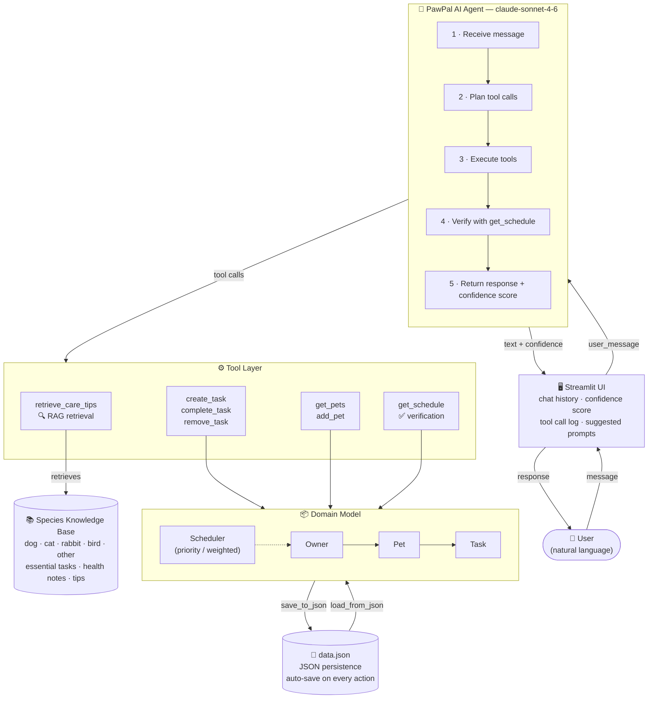

# PawPal+ AI — System Architecture Diagram

## Component Summary

| Component | Role |
|---|---|
| **Streamlit UI** | Tab-based interface (Pets & Tasks / Schedule / AI Assistant). Displays chat history, confidence scores, and collapsible tool call logs. |
| **PawPal AI Agent** | Claude-powered agentic loop. Calls tools repeatedly until `stop_reason == "end_turn"`, then returns the final response. System prompt is cached for efficiency. |
| **retrieve_care_tips** | RAG tool. Retrieves curated species-specific care knowledge from the built-in knowledge base before the agent generates recommendations. |
| **create/complete/remove_task** | Mutation tools. Directly modify the in-memory `Owner` object. |
| **get_schedule** | Verification tool. Called after mutations to confirm the updated plan fits the time budget and has no conflicts. |
| **Species Knowledge Base** | Static curated store: essential tasks, health notes, and tips for 5 species. Acts as the retrieval corpus for the RAG pattern. |
| **Domain Model** | `Owner → Pet → Task` hierarchy + `Scheduler`. Pure Python dataclasses with no UI dependencies. |
| **data.json** | Persistent store. Auto-saved after every agent action and every Streamlit rerun. |

## Human Checkpoints

- Confidence score displayed on every AI response (🟢 ≥ 80% · 🟡 50–79% · 🔴 < 50%)
- Tool call log expandable in the UI — user can see exactly what the agent changed
- All changes immediately visible in the Pets & Tasks and Schedule tabs
- Conversation can be reset at any time with the "Clear" button
