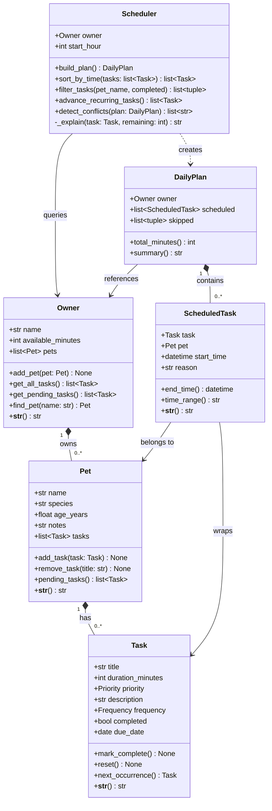

# PawPal+ UML Class Diagram — Final

> Updated to match the final implementation in `pawpal_system.py`.

## Design changes from initial UML

| Area | Initial | Final |
|---|---|---|
| `Task` | title, duration, priority | + `frequency`, `completed`, `due_date`, `mark_complete()`, `reset()`, `next_occurrence()` |
| `Pet` | name, species, age | + `tasks` list, `add_task()`, `remove_task()`, `pending_tasks()` — Pet now *owns* its tasks |
| `Owner` | name, available_minutes | + `pets` list, `add_pet()`, `get_all_tasks()`, `get_pending_tasks()`, `find_pet()` |
| `Scheduler` | `build_plan(tasks)` takes a task list | `build_plan()` queries owner directly; + `sort_by_time()`, `filter_tasks()`, `advance_recurring_tasks()`, `detect_conflicts()` |
| `DailyPlan` | single list of tasks | + `skipped` list (Task, Pet, reason tuples); + `summary()` |
| `ScheduledTask` | task + start_time + reason | + `pet` field so the plan knows which pet each task belongs to |

## Relationships

| Relationship | Type | Description |
|---|---|---|
| `Owner` ◆ `Pet` | Composition | Pets are created and managed through the Owner |
| `Pet` ◆ `Task` | Composition | Tasks live on the Pet, not as free-floating objects |
| `Scheduler` → `Owner` | Dependency | Scheduler calls `owner.get_pending_tasks()` to build the plan |
| `Scheduler` ‥▷ `DailyPlan` | Creation | `build_plan()` instantiates and returns a DailyPlan |
| `DailyPlan` ◆ `ScheduledTask` | Composition | ScheduledTasks only exist within a DailyPlan |
| `ScheduledTask` → `Task` / `Pet` | Association | Wraps a Task and records which Pet it belongs to |
